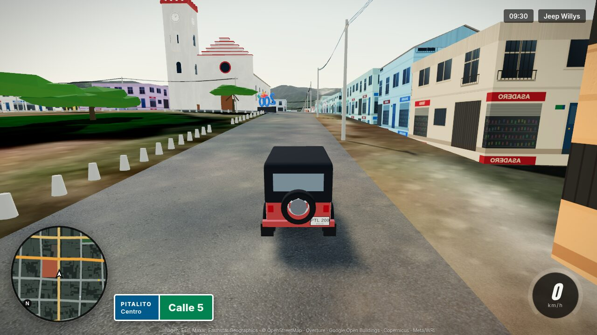
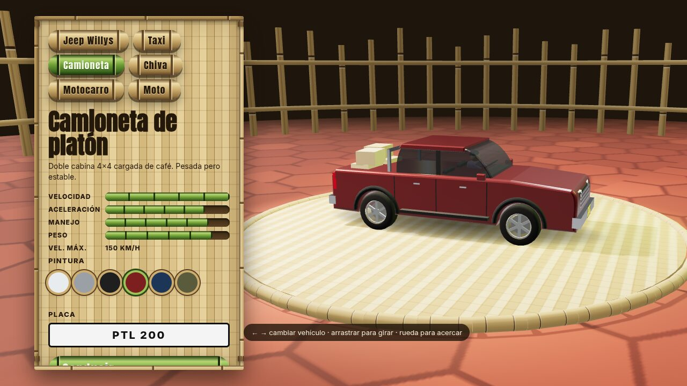
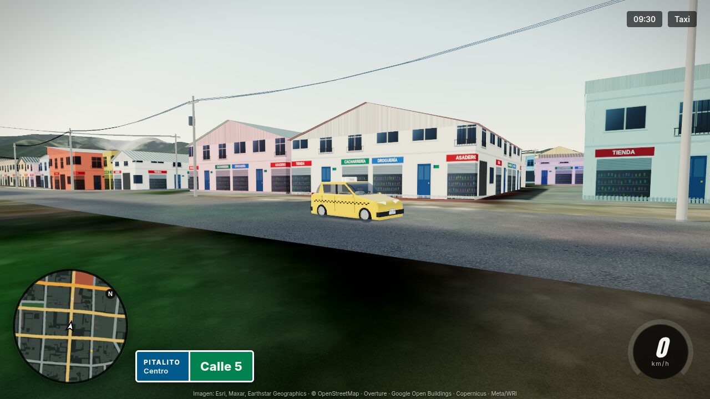
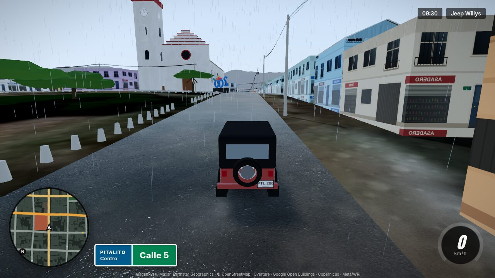

# Pitalito City

Juego web de mundo abierto ambientado en **Pitalito, Huila (Colombia)**, recorrible en carro. El mundo se
reconstruye con **datos geográficos reales**: calles de OpenStreetMap, ~21.800 huellas de edificios, ~21.500 árboles
medidos desde satélite, el relieve del Valle de Laboyos y el suelo en imagen satelital. Arrancás en el Parque
Principal José Hilario López, frente a la Torre San Antonio.



| Garaje en guadua | Barrio con techos de lámina | Aguacero |
|---|---|---|
|  |  |  |

## Inicio rápido

```bash
npm install
npm run dev        # http://localhost:5173
```

Requisitos: Node ≥ 20 y un navegador con WebGL2. `public/world/` ya viene generado; regenerar los datos requiere
además GDAL (ver [docs/DATOS.md](docs/DATOS.md)).

| Comando | Qué hace |
|---|---|
| `npm run dev` | Servidor de desarrollo |
| `npm run build` / `preview` | Build estático en `dist/` / servirlo |
| `npm run setup` | Descarga y regenera todos los datos (`data:fetch`, `data:google`, `data:rasters`, `data:build`, `refs:fetch`) |
| `npm run shot` / `shot:vehicle` | Capturas automáticas para verificar cambios |

## Controles

| Tecla | Acción |
|---|---|
| W/S · ↑/↓ | Acelerar / frenar y reversa |
| A/D · ←/→ | Girar |
| Espacio | Freno de mano |
| M | Mapa: clic = destino GPS, doble clic = viajar, buscador de lugares |
| C | Cámara (persecución, lejana, capó, cinemática, aérea) · arrastrar = orbitar · rueda = zoom |
| V | Garaje: vehículo, pintura y placa |
| Esc | Pausa |
| N / H | Adelantar 3 horas / pito |
| R / T / G | Volver a la vía / ir al parque / borrar ruta |
| B / F1 | Rendimiento / ayuda |

Gamepad: RT acelera, LT frena, stick izquierdo gira, A freno de mano.

## Qué incluye

- **Mundo real**: suelo satelital sobre relieve Copernicus, edificios de OSM + Google + Microsoft con el color real
  de su techo, árboles con su posición y tamaño medidos, 1.777 vías con nombre. Lo estimado (fachadas, forma de
  techos, postes) está declarado en [docs/DATOS.md](docs/DATOS.md#qué-es-real-y-qué-es-estimado).
- **6 vehículos** modelados sobre fotos: Jeep Willys, taxi, camioneta de platón, chiva, motocarro y moto.
- **Juego**: tráfico IA, GPS con rutas por las calles reales, minimapa, placa de calle con la nomenclatura oficial
  de Pitalito, física con pendientes, día/noche, lluvia.
- **Interfaz en guadua**: menú principal, pausa, opciones (4 presets de calidad), créditos y garaje 3D.

## Documentación

| Documento | Contenido |
|---|---|
| [docs/ARQUITECTURA.md](docs/ARQUITECTURA.md) | Pipeline, runtime, formatos, mapa de módulos, cómo extender |
| [docs/TECNOLOGIAS.md](docs/TECNOLOGIAS.md) | Stack, versiones, por qué se eligió cada cosa, técnicas de render |
| [docs/DATOS.md](docs/DATOS.md) | Fuentes, licencias, pipeline, calibraciones, qué es real y qué estimado |
| [docs/REGLAS.md](docs/REGLAS.md) | Reglas de fidelidad, licencias, coordenadas, arquitectura, rendimiento, estilo |
| [docs/VERIFICACION.md](docs/VERIFICACION.md) | Cómo probar cambios, capturas automáticas, depuración |
| [docs/ESTADO.md](docs/ESTADO.md) | Estado, bitácora de decisiones, limitaciones, hoja de ruta |
| [assets/README.md](assets/README.md) | Organización de referencias visuales y texturas |
| [AGENTS.md](AGENTS.md) | Resumen operativo para asistentes de IA |

## Estructura

```
├── src/            juego (navegador) — ver docs/ARQUITECTURA.md#mapa-de-módulos
├── scripts/        pipeline de datos (Node + GDAL)
├── public/world/   mundo generado (tiles, grafo vial, relieve) — versionado
├── public/textures/texturas PBR CC0 y decals
├── assets/         referencias fotográficas con créditos (no se sirven al juego)
├── tools/          verificación visual automática
├── docs/           documentación
└── data/raw/       datos crudos descargados — NO versionado
```

## Créditos y licencias

Datos: © colaboradores de OpenStreetMap (ODbL), Overture Maps, Google Open Buildings (CC BY 4.0), Copernicus GLO-30,
Meta & WRI Canopy Height (CC BY 4.0), JRC GHSL (CC BY 4.0). Imagen satelital: Esri, Maxar, Earthstar Geographics
(se pide en vivo; atribución visible en el juego). Referencias fotográficas: Wikimedia Commons, autores y licencias
en [assets/references/CREDITS.md](assets/references/CREDITS.md). Texturas: ambientCG (CC0).

Los datos derivados de OpenStreetMap en `public/world/` se distribuyen bajo ODbL. El código aún no tiene licencia
definida. Proyecto de fans sin relación con Rockstar Games.
